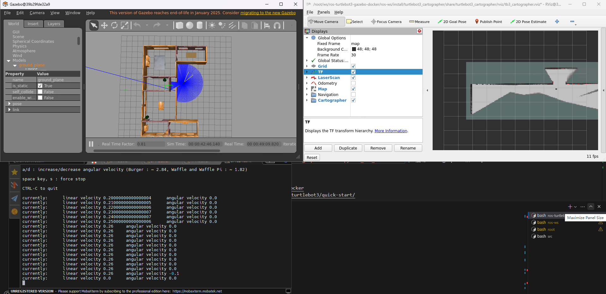

# ros-turtlebot3-gazebo-docker

基于 ROS 2 Humble、TurtleBot3 与 Gazebo 的一键仿真镜像与启动脚本。该仓库提供可用于本地或虚拟机环境的 Docker 镜像、启动脚本与编译工具，方便快速搭建 SLAM / 仿真开发环境。



## 特性

- 基于 ROS 2 Humble 的镜像，预装 Gazebo、RViz、Cartographer、Navigation2 等常用包
- 包含编译与运行的脚本 `build.sh`、`start_docker.sh`、`start_sim.py`
- 支持把宿主机工作区挂载到容器，便于开发与调试

## 前提

- 已安装 Docker
- 若在国内网络，可能需配置代理或使用镜像站加速镜像拉取

## 克隆仓库

包含子模块：

```bash
git clone --recurse-submodules https://github.com/Ts-sound/ros-turtlebot3-gazebo-docker.git
```

（若无法访问 GitHub，可尝试调整 hosts 或使用代理）

## 构建 Docker 镜像

进入 `src` 目录并运行构建脚本：

```bash
cd src && ./build.sh
```

构建成功后，使用 `sudo docker images` 查看镜像：

```bash
sudo docker images
```

> 说明：在国内网络环境下直接从 Docker Hub 拉取基础镜像可能失败，可使用国内镜像站或代理。

如果你不方便构建，本仓库在 Releases 中提供了docker镜像导出文件（示例）：

- 镜像文件: https://github.com/Ts-sound/ros-turtlebot3-gazebo-docker/releases/download/v0.0.5/ros2-humble-turtlebot3-sim-v0.0.5.tar.gz

导入示例：

```bash
sudo docker load < ros2-humble-turtlebot3-sim-v0.0.5.tar.gz
```

## 启动容器（示例）

仓库提供了 `start_docker.sh`，会基于构建好的镜像启动容器：

```bash
cd src && sudo ./start_docker.sh
```

或者手动运行：

```bash
docker run -itd \                          # 后台交互模式
  --privileged \                           # 赋予特权（如访问硬件设备）
  --shm-size=1g \                          # 共享内存
  --ulimit memlock=-1 \                    # 允许进程锁定内存
  --ulimit stack=67108864 \                # 设置栈大小
  --name sim \                             # 容器名称
  -p 2202:22 \                             # 将容器 SSH 映射到宿主机 2202
  ros2-humble-turtlebot3-sim \             # 镜像名称（以实际镜像名为准）
  /bin/bash -c "service ssh start && /bin/bash"
```

安全提示：容器内启用 root 密码登录有安全风险，建议启动后尽快修改密码、禁用密码登录并使用 SSH 密钥登录。

可以将宿主机目录挂载到容器：

```bash
-v /path/to/your/ws:/root/ws
```

## SSH 登录容器

示例（宿主机或其它机器）：

```bash
ssh root@<宿主机IP> -p 2202
```

在 Windows 上推荐使用 MobaXterm（自带 X11 server，方便显示 Gazebo/Rviz 窗口）。

## 在容器内编译仿真组件

本仓库的仿真工作区为 `ros-ws`，`build_turtlebot3_sim.sh` 用于编译 `turtlebot3_simulations` 等组件。

示例：

```bash
# 进入工作区并配置环境
cd ~/ros-ws
source /opt/ros/humble/setup.bash
colcon build --symlink-install
```

## 启动仿真（一键脚本）

仓库提供 `start_sim.py`，使用 screen 启动多个节点会话（world/gazebo、slam、teleop 等）。在容器内运行：

```bash
cd ~/ros-ws && python3 start_sim.py
```

查看 screen 会话：

```bash
screen -ls
```

输出:

```bash
There are screens on:
        7609.key        (09/20/2025 04:03:15 AM)        (Detached)
        7592.world      (09/20/2025 04:03:15 AM)        (Detached)
        7598.slam       (09/20/2025 04:03:15 AM)        (Detached)
3 Sockets in /run/screen/S-root
```

示例会话说明：

- `world`：启动 Gazebo 世界（例如 `turtlebot3_house.launch.py`）
- `slam`：启动 Cartographer（`cartographer.launch.py use_sim_time:=True`）
- `key`：键盘遥控（`ros2 run turtlebot3_teleop teleop_keyboard`）

运行效果如上图所示（见 assets/gazebo_sim.png）。

## 问题事项

- 问题: Gazebo首次打开的时候，会先从网上或者它自己的模型库里检索模型，所以如果找不到目标模型的话，打开Gazebo就会发现一直卡着不动

> 解决方案: 使用代理拉取资源 , 或手动更新 `git clone https://github.com/osrf/gazebo_models && cp -r gazebo_models/* ~/.gazebo/models/`

## 参考

- [TurtleBot3 Quick Start](https://emanual.robotis.com/docs/en/platform/turtlebot3/quick-start/)

---
