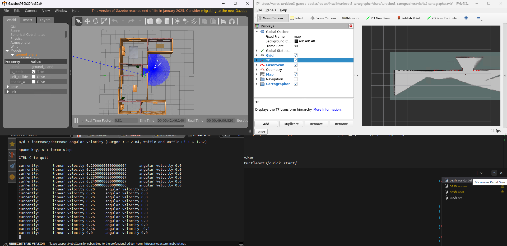

# ROS 2 TurtleBot3 Gazebo Docker

基于 ROS 2 Humble、TurtleBot3 与 Gazebo 的一键仿真环境。



## 特性

- 基于 ROS 2 Humble，预装 Gazebo、RViz、Cartographer SLAM、Navigation2
- 支持 Docker Compose 一键启动容器
- 支持 GitHub Container Registry (GHCR) 直接拉取镜像，无需本地构建
- 支持 SSH 远程访问容器，方便开发调试

## 快速开始

### 方式一：拉取 GHCR 镜像（推荐）

无需本地构建，直接从 GHCR 拉取预构建镜像：

```bash
# 拉取镜像
docker pull ghcr.io/ts-sound/ros-turtlebot3-gazebo-docker:latest

# 使用 Docker Compose 启动容器
docker compose up -d

# 进入容器
docker exec -it sim bash
```

### 方式二：本地构建

```bash
# 克隆仓库（包含子模块）
git clone --recurse-submodules https://github.com/Ts-sound/ros-turtlebot3-gazebo-docker.git
cd ros-turtlebot3-gazebo-docker

# 构建镜像
./scripts/build.sh

# 使用 Docker Compose 启动容器
docker compose up -d
```

> 注：本地构建需要较长时间（30-45 分钟），因为需要安装 Gazebo、Navigation2 等大型包。

## 前提条件

- 已安装 Docker 和 Docker Compose v2
- 若需运行 Gazebo 图形界面，宿主机需有 X11 环境（Linux）或 X Server（Windows 推荐 MobaXterm）
- 若在国内网络环境，可能需要配置代理或使用镜像站加速

## 使用说明

### Docker Compose 配置

`docker-compose.yml` 定义了仿真容器 `sim`，关键配置如下：

| 配置项 | 说明 |
|--------|------|
| privileged | 赋予容器特权（访问硬件设备） |
| shm_size | 共享内存 1GB |
| ports | 宿主机 2202 端口映射到容器 SSH (22) |
| ulimits | memlock: -1, stack: 64MB |

**挂载本地工作区**：编辑 `docker-compose.yml`，取消 `volumes` 注释并修改路径：

```yaml
volumes:
  - /path/to/your/ws:/root/ws
```

### 容器管理

```bash
# 启动容器
docker compose up -d

# 查看容器状态
docker compose ps

# 进入容器
docker exec -it sim bash

# 停止并删除容器
docker compose down
```

### SSH 登录容器

```bash
ssh root@<宿主机IP> -p 2202
```

> **安全提示**：容器内启用 root 密码登录存在安全风险，建议启动后尽快修改密码、禁用密码登录并配置 SSH 密钥。

### 运行仿真

进入容器后，运行一键仿真脚本：

```bash
cd ~/ros-ws && python3 start_sim.py
```

该脚本通过 `screen` 启动三个会话：

| 会话名 | 说明 |
|--------|------|
| world | Gazebo 仿真世界（turtlebot3_house） |
| slam | Cartographer SLAM |
| key | 键盘遥控 |

查看和管理 screen 会话：

```bash
screen -ls          # 列出所有会话
screen -r world     # 重新连接 world 会话
```

### 在容器内编译组件

```bash
cd ~/ros-ws
source /opt/ros/humble/setup.bash
colcon build --symlink-install
```

## 旧版脚本（向后兼容）

以下方式仍然可用，但推荐使用 Docker Compose：

```bash
# 构建（等同于 docker build）
./scripts/build.sh

# 启动（等同于 docker compose up）
./scripts/start_docker.sh
```

## 常见问题

### Gazebo 首次启动卡住加载模型

**原因**：Gazebo 首次启动会从在线模型库下载模型，网络慢时会长时间卡住。

**解决方案**：

```bash
git clone https://github.com/osrf/gazebo_models
cp -r gazebo_models/* ~/.gazebo/models/
```

### 国内网络无法拉取基础镜像

配置 Docker 镜像加速器或使用代理。

### SSH 连接被拒绝

确认容器正在运行且 SSH 服务已启动：

```bash
docker exec sim service ssh status
```

## 参考

- [TurtleBot3 官方文档](https://emanual.robotis.com/docs/en/platform/turtlebot3/quick-start/)
- [ROS 2 Humble 文档](https://docs.ros.org/en/humble/)
- [Navigation2 文档](https://navigation.ros.org/)
